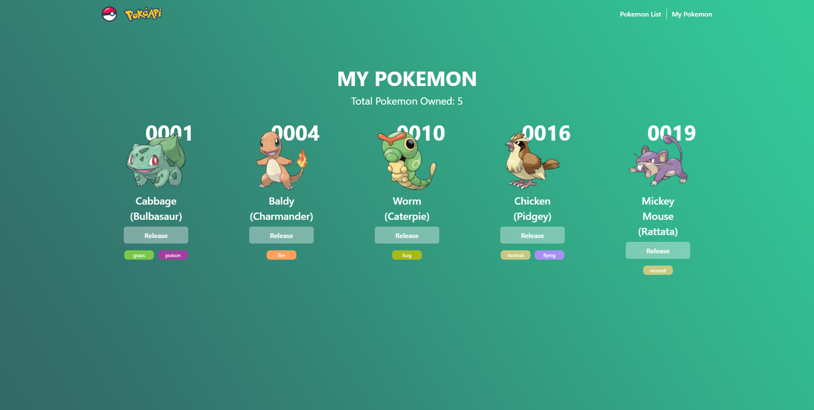

# PokeWeb
Simple Website to show PokeAPI (https://github.com/mazipan/graphql-pokeapi).
Built using Create React App

## Techs Used
1. React with React Hooks and React Context
2. GraphQL with Apollo Client
3. CSS-in-JS using Emotion
4. Webpack

## How to Run
1. Clone repository
2. Go to root /
3. Install requirements
    ```
    yarn install
    ```
4. Build
    ```
    yarn build
    ```
5. Start
    ```
    yarn start
    ```
6. Open localhost:3000

## Pages Endpoint
1. /
2. /my-pokemon
3. /detail/:name

## Screenshots



